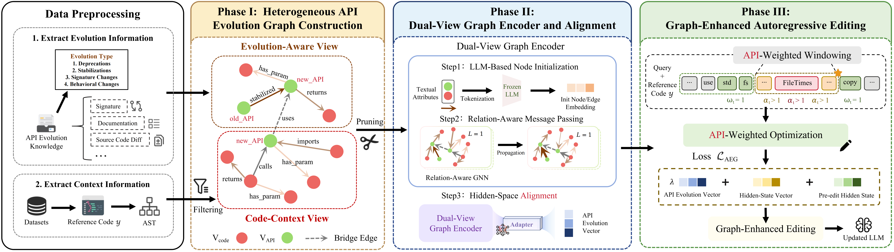

<div align="center">

# 🌟 AEG-Edit
### Bridging API Evolution and Code Semantics for Accurate API Usage in Code Generation

<p>
  <a href="https://doi.org/10.5281/zenodo.19337309"></a>
  
  
</p>

</div>
<br>

## ✨ Overview

AEG-Edit improves autoregressive model editing with structured API-evolution and code-context signals. It builds a dual-view heterogeneous graph, aligns the graph representation with the LLM hidden space, and focuses optimization on evolution-relevant code positions.

<p align="center">
  
</p>

The framework consists of three stages: heterogeneous API evolution graph construction, dual-view graph encoding and alignment, and graph-enhanced autoregressive editing.

## 🗂️ Repository Structure

| Path | Description |
| --- | --- |
| `methods/AEG_Edit/` | AEG-Edit implementations for `MEMIT-ARE`, `AlphaEdit-ARE`, and `UnKE-ARE` |
| `methods/Baselines/` | Model-editing baselines, including `ROME`, `GRACE`, `AGRACE`, `MEMIT-ARE`, `AlphaEdit-ARE`, and `UnKE-ARE` |
| `scripts/` | Graph construction and dataset preparation utilities |
| `experiments/` | End-to-end experiment entry points |
| `dsets/` | Dataset loaders for `RustEvo2+` and `PyEvo` |
| `data/` | Benchmark data and API documentation |
| `hparams/` | Method- and model-specific hyperparameters |
| `figure/` | README and paper figures |

## 🧾 Data

The evaluation CLI exposes `RustEvo2+` as `rustevo` (`data/RustEvo/RustEvo.json`) and `PyEvo` as `pyevo` (`data/PyEvo/PyEvo.json`). AEG-enhanced methods also require Heterogeneous API Evolution Graph files, which can be generated with the scripts below.

### 📊 Dataset Statistics

| Evolution Type | RustEvo2+ | PyEvo |
| --- | ---: | ---: |
| Stabilization | 222 (31.36%) | 220 (35.37%) |
| Signature Change | 242 (34.18%) | 133 (21.38%) |
| Behavioral Change | 217 (30.65%) | 201 (32.32%) |
| Deprecation | 27 (3.81%) | 68 (10.93%) |
| Total | 708 | 622 |

### 🦀 RustEvo2+ Task Format

Each `RustEvo2+` task contains API Evolution Knowledge, a query and rephrased query, a function signature, reference code, and a test program. The evolution context provides the API name, module path, versions, signatures, documentation, and source code, while tests validate both functional correctness and API usage.

Representative `RustEvo2+` API Evolution Knowledge excerpt:

```json
{
  "name": "extract_if",
  "from_version": "1.87.0",
  "to_version": "1.88.0",
  "module": "std::collections::hash::map",
  "type": "method",
  "change_type": "signature",
  "signature": "pub fn extract_if<F>(&mut self, pred: F) -> ExtractIf<'_, K, V, F>",
  "old_signature": "pub fn drain_filter<F>(&mut self, pred: F) -> DrainFilter<'_, K, V, F>",
  "documentation": "Creates an iterator which uses a closure to determine if a map element should be removed. The `drain_filter` method was completely removed and replaced by `extract_if`.",
  "old_source_code": "pub fn drain_filter<F>(&mut self, pred: F) -> DrainFilter<'_, K, V, F>\\nwhere\\n    F: FnMut(&K, &mut V) -> bool,\\n{\\n    DrainFilter { base: ... }\\n}",
  "source_code": "pub fn extract_if<F>(&mut self, pred: F) -> ExtractIf<'_, K, V, F>\\nwhere\\n    F: FnMut(&K, &mut V) -> bool,\\n{\\n    ExtractIf { base: ... }\\n}"
}
```

This `RustEvo2+` entry captures a breaking change in `HashMap`'s conditional-removal API: the nightly-only `drain_filter` method was removed and replaced by `extract_if`, which became stable in Rust 1.88. Because the method name and iterator type changed, legacy calls fail with a `method not found` error and must be migrated to the new API. See the [Rust 1.68.0 unstable documentation](https://doc.rust-lang.org/1.68.0/std/collections/struct.HashMap.html#method.drain_filter), the [current stable documentation](https://doc.rust-lang.org/stable/std/collections/struct.HashMap.html#method.extract_if), and [Rust tracking issue #59618](https://github.com/rust-lang/rust/issues/59618) for the evolution history.

Representative `RustEvo2+` task example:

```json
{
  "name": "extract_if",
  "from_version": "1.87.0",
  "to_version": "1.88.0",
  "module": "std::collections::hash::map",
  "change_type": "signature",
  "function_signature": "fn extract_zero_values_and_count(map: &mut HashMap<String, u32>) -> (Vec<(String, u32)>, usize)",
  "query": "Given a mutable reference to a `HashMap<String, u32>`, implement a function that conditionally removes entries where the value is zero, collects them into a vector, and returns the total count of remaining entries. The removal process must be efficient and avoid unnecessary reallocation or copying of the non-removed entries. How would you structure this to leverage an iterator that yields extracted items directly?",
  "rephrased_query": "Implement a function that efficiently trims a hash map by removing entries with zero values, pushing the removed keys into a given vector, and returning the number of entries left. The solution should avoid reallocations or shifting and use an iterator that directly removes matching entries without extra storage.",
  "code": "use std::collections::HashMap;\\n\\nfn extract_zero_values_and_count(map: &mut HashMap<String, u32>) -> (Vec<(String, u32)>, usize) {\\n    let mut extracted = Vec::new();\\n\\n    // Legacy drain_filter was removed and renamed to extract_if\\n    let mut extractor = map.extract_if(|_, v| *v == 0);\\n    \\n    while let Some(item) = extractor.next() {\\n        extracted.push(item);\\n    }\\n    \\n    (extracted, map.len())\\n}",
  "test_program": "#[cfg(test)]\\nmod tests {\\n    use super::*;\\n    use std::collections::HashMap;\\n\\n    // ... (HashMap extraction allocation tests omitted for brevity) ...\\n}"
}
```

This example maps a profound standard-collection breakage: early code iterating with `map.drain_filter(...)` used to compile but completely fails in newer stabilized versions. The task effectively benchmarks whether the edited LLM can recognize this collection-level paradigm shift, discard the legacy API assumption, and adopt the newly formed `extract_if` closure semantics to satisfy the compilation requirements.

## 🛠️ Environment Setup

### 🐍 1. Python Environment

You can quickly set up the required dependencies (Python 3.10.19) using the provided Conda profile:

```bash
conda env create -f environment.yml
conda activate AEG
```

Alternatively, if you prefer installing dependencies via `pip` or experience resolution issues:

```bash
conda create -n AEG python=3.10.19
conda activate AEG
pip install -r requirements.txt
```

### 🦀 2. Rust Toolchains

Install Rust toolchains used by the Rust benchmark:

```bash
curl --proto '=https' --tlsv1.2 -sSf https://sh.rustup.rs | sh
rustup toolchain install 1.72.0 1.73.0 1.74.0 1.75.0 1.76.0 1.77.0 1.78.0 1.79.0 1.80.0 1.81.0 1.82.0 1.83.0 1.84.0 1.85.0 1.86.0 1.87.0 1.88.0 1.89.0 1.90.0 1.91.0
```

## 🔬 Build Heterogeneous API Evolution Graphs

Generate the precomputed Heterogeneous API Evolution Graph inputs before running AEG-enhanced methods:

```bash
python scripts/build_rustevo_graphs.py --output_dir ./data/rustevo_graphs
python scripts/build_pyevo_graphs.py --output_dir ./data/pyevo_graphs
```

This will create:

- `data/rustevo_graphs/rustevo_graphs.json`
- `data/pyevo_graphs/pyevo_graphs.json`

## 🚀 Run AEG-Edit

### 💻 Example Command

Example: `MEMIT_ARE_AEG` on `RustEvo2+` (`--ds_name rustevo` in code):

```bash
python experiments/evaluate_gnn.py \
  --alg_name MEMIT_ARE_AEG \
  --model_name /path/to/Llama-3.1-8B-Instruct \
  --hparams_fname Llama3.1-8B-Instruct.json \
  --ds_name rustevo \
  --graph_dir ./data/rustevo_graphs \
  --dataset_size_limit 200
```

### 📌 Common Arguments

Key arguments select the method (`--alg_name`), model checkpoint (`--model_name`), matching hyperparameters (`--hparams_fname`), benchmark (`--ds_name`: `rustevo` or `pyevo`), and precomputed graph directory (`--graph_dir`). Use `--dataset_size_limit` to cap evaluation size and `--num_edits` to set the editing batch size. For a non-AEG baseline, choose its algorithm name and matching file under `hparams/`.

### 🧩 Supported Methods

| Category | Methods | Entry Point |
| --- | --- | --- |
| **AEG-Edit** | `MEMIT_ARE_AEG`, `AlphaEdit_ARE_AEG`, `UnKE_ARE_AEG` | `experiments/evaluate_gnn.py` |
| **Model Editing** | `MEMIT_ARE`, `AlphaEdit_ARE`, `UnKE_ARE`, `ROME`, `GRACE`, `AGRACE`, `STAR` | `experiments/evaluate_gnn.py` |
| **Fine-Tuning** | `FT-L`, `LoRA`, `AdaLoRA` | `experiments/evaluate_ft.py` |
| **Prompting** | `PB-w/ API`, `PB-w/o API`, `PB-RAG` | `evaluate/RustEvo/` and `evaluate/PyEvo/` |

The prompt-based entry points are `eval_baseline_w_api.py`, `eval_baseline_wo_api.py`, and `eval_baseline_w_rag.py` under the corresponding benchmark directory.

## 📊 Supplementary Metrics

To evaluate edit specificity and assess whether the editing process degrades general-purpose coding abilities, we report surface-level overlap metrics (BLEU, ROUGE-L, and CodeBLEU). 

**Experimental Setup:** We first randomly sample edit instances from our `RustEvo2+` and `PyEvo` datasets to update the model. Then, we evaluate the *after-edit* model's generalized code generation performance exclusively on the `EditEvery` benchmark. It is crucial to note that the code generation tasks in `EditEvery` are generalized programming problems that are completely **unrelated** to the specific API evolution tasks introduced in our dataset.

| Method | BLEU (Base / After / Δ) | ROUGE-L (Base / After / Δ) | CodeBLEU (Base / After / Δ) |
| --- | --- | --- | --- |
| **Llama-3.1-8B-Instruct** | | | |
| MEMIT-ARE | 8.16 / 28.36 / +20.21 | 14.36 / 32.16 / +17.80 | 5.38 / 22.99 / +17.61 |
| AEG-Edit | 8.16 / 31.29 / +23.13 | 14.36 / 32.07 / +17.71 | 5.38 / 24.41 / +19.03 |
| **Qwen2.5-7B-Instruct** | | | |
| MEMIT-ARE | 8.01 / 19.65 / +11.64 | 13.89 / 27.10 / +13.21 | 5.23 / 18.84 / +13.61 |
| AEG-Edit | 8.01 / 18.30 / +10.29 | 13.89 / 25.64 / +11.75 | 5.23 / 17.43 / +12.20 |

As shown above, the edits paradoxically increase reference overlap on unrelated tasks. While model editing is generally known to induce some degradation or interference in broader code generation capabilities, we observe that these text-based metrics artificially inflate. This inflation often occurs because surface-level metrics are highly sensitive to superficial distribution shifts induced by the editing process—such as models reverting to overly verbose structural templates (e.g., redundant imports, repetitive boilerplate code, or generic markdown code wrappers)—rather than reflecting genuine algorithmic improvement or syntactic correctness.

For this reason, we exclude BLEU, ROUGE-L, and CodeBLEU from our primary evaluation, as higher textual similarity does not consistently reflect executable correctness in code generation tasks. We report them here solely for completeness as supplementary indicators; our main evaluation relies entirely on rigorous execution-based `Pass@1` validations to capture true behavioral code-generation impact.

## 📚 Citation

If you use AEG-Edit, please cite our ASE 2026 paper. The official BibTeX entry will be added once the proceedings metadata is available.

## 🙏 Acknowledgments

We sincerely thank the authors of [AnyEdit](https://github.com/jianghoucheng/AnyEdit), [MEMIT](https://github.com/kmeng01/memit.git), and [UnKE](https://github.com/TrustedLLM/UnKE.git) for releasing their code and making this work possible.

We also thank the authors of [RustEvo$^2$](https://github.com/SYSUSELab/RustEvo) for providing the benchmark foundation that supports our Rust API evolution evaluation.
